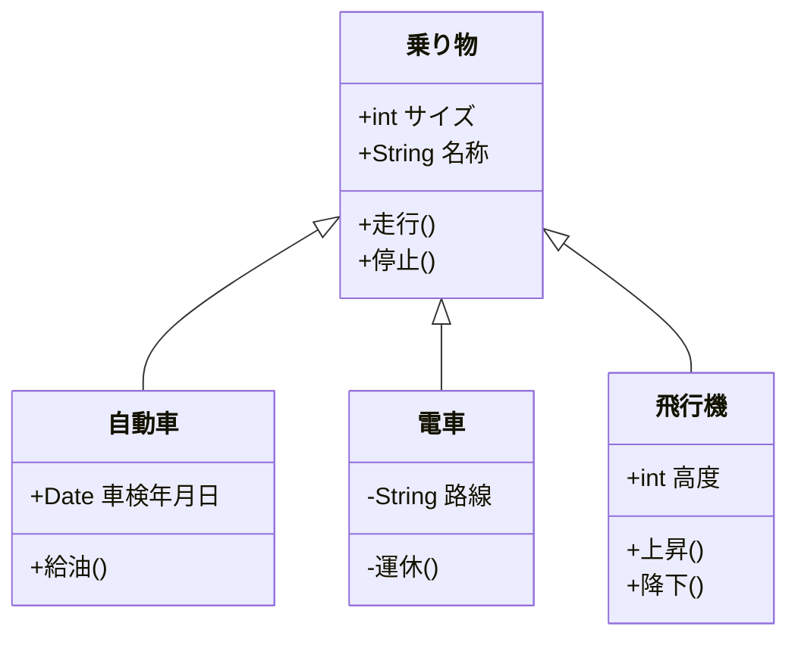
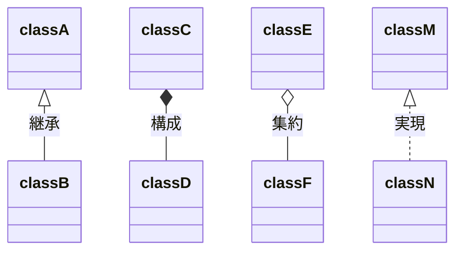
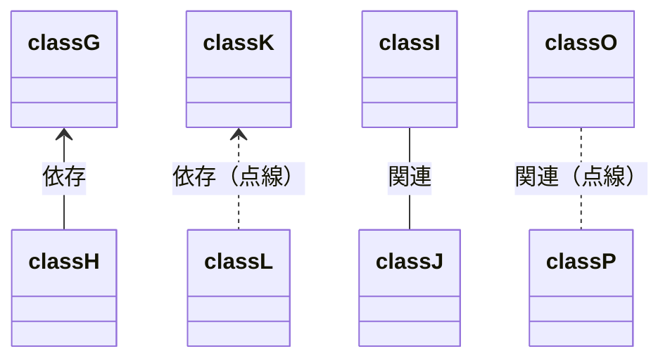
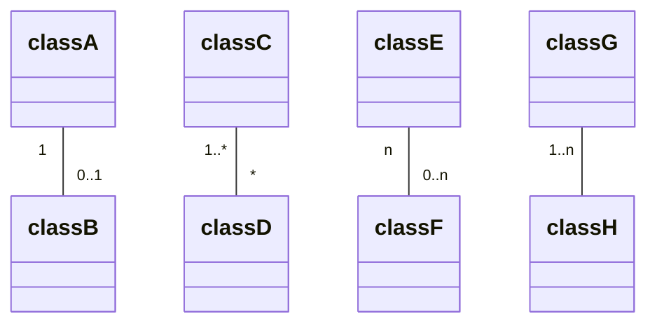

```text
classDiagram
    乗り物 <|-- 自動車
    乗り物 <|-- 電車
    乗り物 <|-- 飛行機
    乗り物 : +int サイズ
    乗り物 : +String 名称
    乗り物: +走行()
    乗り物: +停止()
    class 自動車{
        +Date 車検年月日
        +給油()
    }
    class 電車{
        -String 路線
        -運休()
    }
    class 飛行機{
        +int 高度
        +上昇()
        +降下()
    }
```



### 関係性

```text
classDiagram
    classA <|-- classB : 継承
    classC *-- classD : 構成
    classE o-- classF : 集約
    classM <|.. classN : 実現
```



```text
classDiagram
    classG <-- classH : 依存
    classK <.. classL : 依存（点線）
    classI -- classJ : 関連
    classO .. classP : 関連（点線）
```



### 多重度

```text
classDiagram
    classA "1" -- "0..1" classB
    classC "1..*" -- "*" classD
    classE "n" -- "0..n" classF
    classG "1..n" -- classH
```


