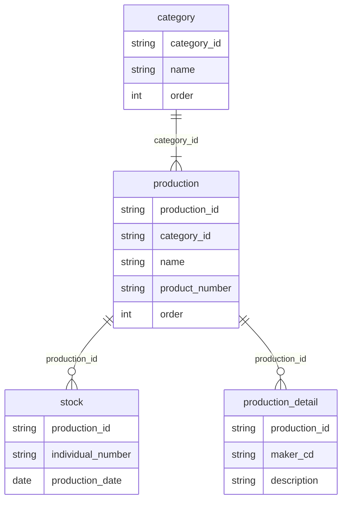

```text
erDiagram
    category ||--|{ production : category_id
    production ||--o{ stock : production_id
    production ||--o{ production_detail : production_id
    category {
        string category_id
        string name
        int order
    }
    production {
        string production_id
        string category_id
        string name
        string product_number
        int order
    }
    stock {
        string production_id
        string individual_number
        date production_date
    }
    production_detail {
        string production_id
        string maker_cd
        string description
    }
```


