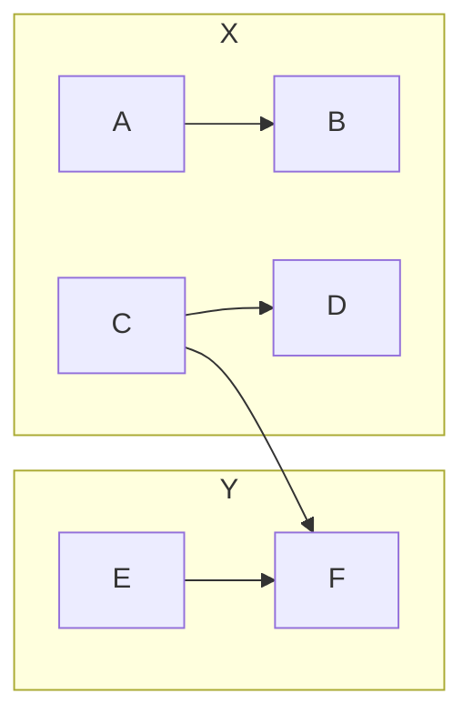
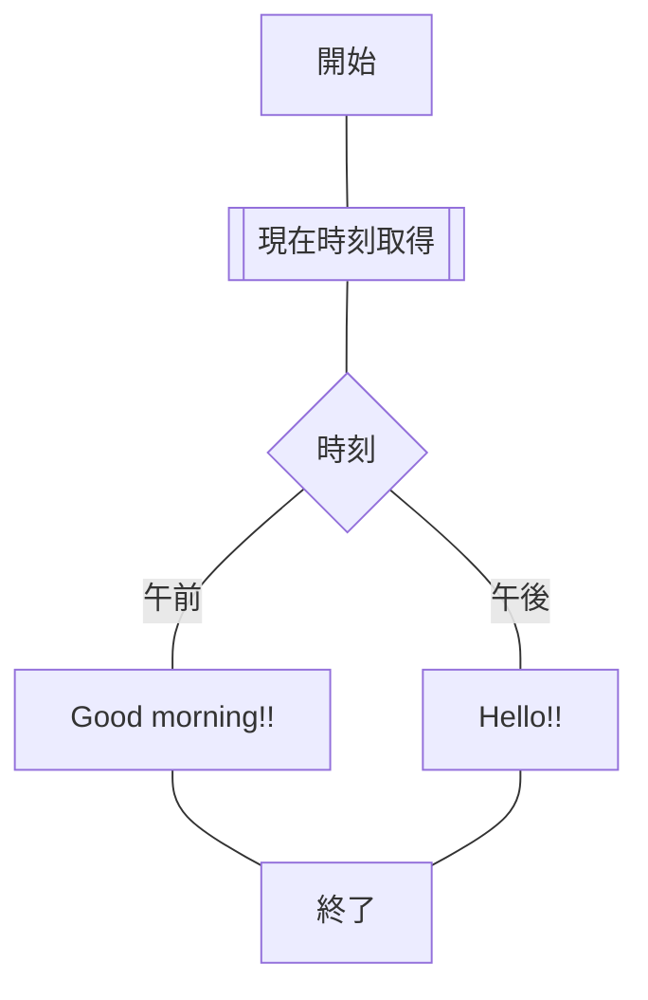

## 方向

-   縦

    ```text
    graph TB;
        開始-->終了;
    ```

    ```mermaid
    graph TB;
        開始-->終了;
    ```

-   横

    ```text
    graph LR;
        開始-->終了;
    ```

    ```mermaid
    graph LR;
        開始-->終了;
    ```

-   縦逆流

    ```text
    graph BT;
        開始-->終了;
    ```

    ```mermaid
    graph BT;
        開始-->終了;
    ```

-   横逆流

    ```text
    graph RL;
        開始-->終了;
    ```

    ```mermaid
    graph RL;
        開始-->終了;
    ```

## 形

-   角丸

    ```text
    graph TB;
        四角
        id1(角丸);
        id2([角丸]);
        id3((丸));
    ```

    ```mermaid
    graph TB;
        四角
        id1(角丸);
        id2([角丸]);
        id3((丸));
    ```

    ```text
    graph TB;
        id1[[サブルーチン]];
        id2[(DB)];
        id3>リボン];
    ```

    ```mermaid
    graph TB;
        id1[[サブルーチン]];
        id2[(DB)];
        id3>リボン];
    ```

    ```text
    graph TB;
        id1{菱形};
        id2{{六角形}};
        id3[/平行四辺形/];
        id4[\平行四辺形\];
        id5[/台形\];
        id6[\台形/];
    ```

    ```mermaid
    graph TB;
        id1{菱形};
        id2{{六角形}};
        id3[/平行四辺形/];
        id4[\平行四辺形\];
        id5[/台形\];
        id6[\台形/];
    ```

## 線

-   通常

    ```text
    graph LR;
        A --- B;
        C-- 仲間 ---D;
        E---|仲間|F;
    ```

    ```mermaid
    graph LR;
        A --- B;
        C-- 仲間---D;
        E---|仲間|F;
    ```

-   矢印

    ```text
    graph LR;
        A-->B;
        C-- 仲間 -->D;
        E-->|仲間|F;
    ```

    ```mermaid
    graph LR;
        A-->B;
        C-- 仲間 -->D;
        E-->|仲間|F;
    ```

-   点線

    ```text
    graph LR;
        A -.- B;
        C -.-> D;
    ```

    ```mermaid
    graph LR;
        A -.- B;
        C -.-> D;
    ```

-   太線

    ```text
    graph LR;
        A === B;
        C ==> D;
    ```

    ```mermaid
    graph LR;
        A === B;
        C ==> D;
    ```

## グループ化

```text
graph LR;
    C --> F;
    subgraph Y
        E --> F;
    end
    subgraph X
        A --> B;
        C --> D;
    end
```



## スタイル

-   単独

    ```text
    graph LR;
        start_node(開始)-->end_node(終了)
        style start_node fill:#f55,stroke:#0f0,stroke-width:5px,color:#fff
        style end_node fill:#00f,stroke:#555,stroke-width:4px,color:#f00
    ```

    ```mermaid
    graph LR;
        start_node(開始)-->end_node(終了)
        style start_node fill:#f55,stroke:#0f0,stroke-width:5px,color:#fff
        style end_node fill:#00f,stroke:#555,stroke-width:4px,color:#f00
    ```

-   クラス

    ```text
    graph LR;
        start_node(開始):::redclass --> end_node(終了):::redclass
        classDef redclass fill:#f55;
    ```

    ```mermaid
    graph LR;
        start_node(開始):::redclass --> end_node(終了):::redclass
        classDef redclass fill:#f55;
    ```

## 実装例

```text
graph TB;
    start_node[開始] --- get_now[[現在時刻取得]] --- ampm{時刻}
    ampm -- 午前 --- say_gm[Good morning!!] --- end_node;
    ampm -- 午後 --- say_h[Hello!!] --- end_node;
    end_node[終了]
```


