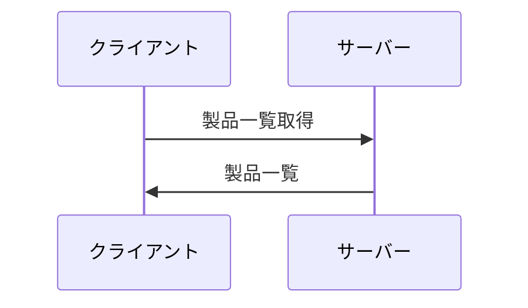
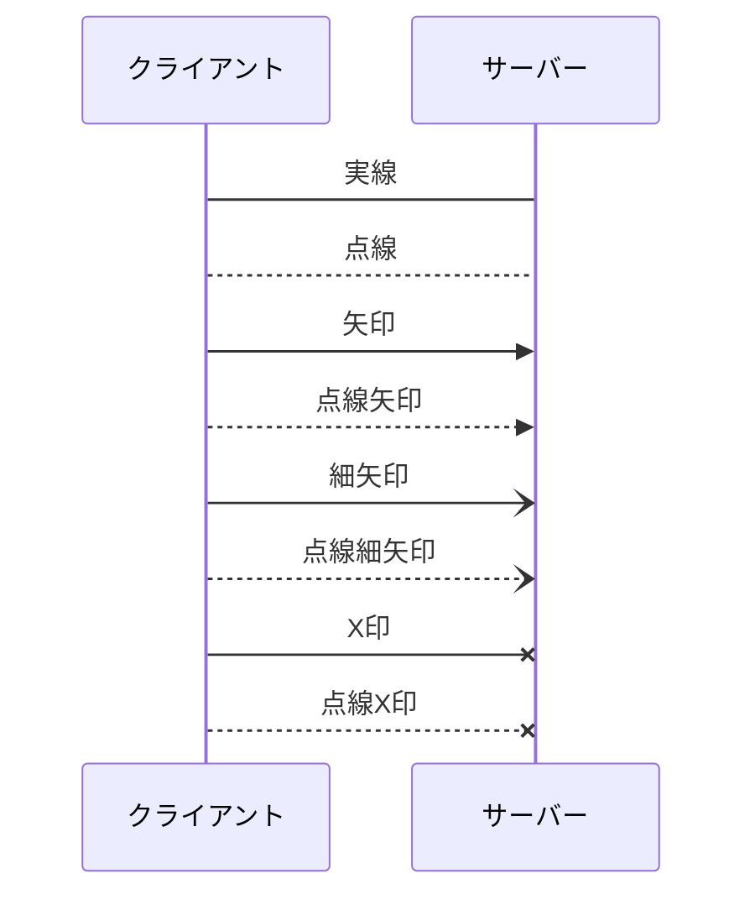
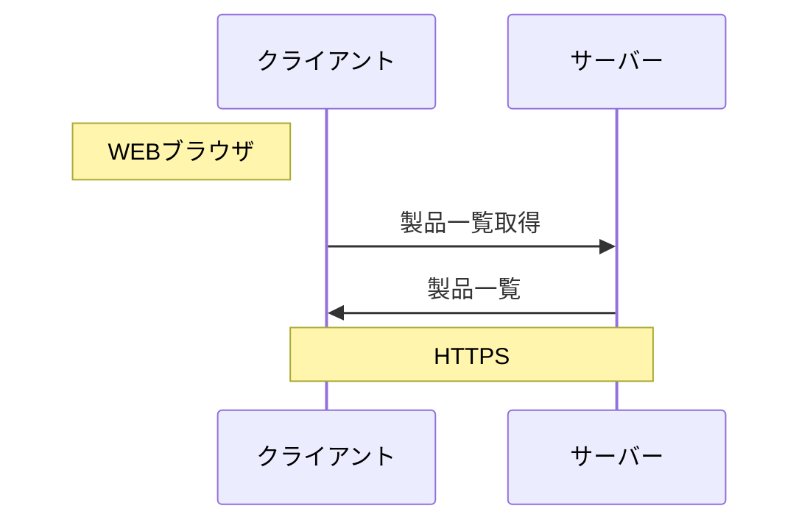
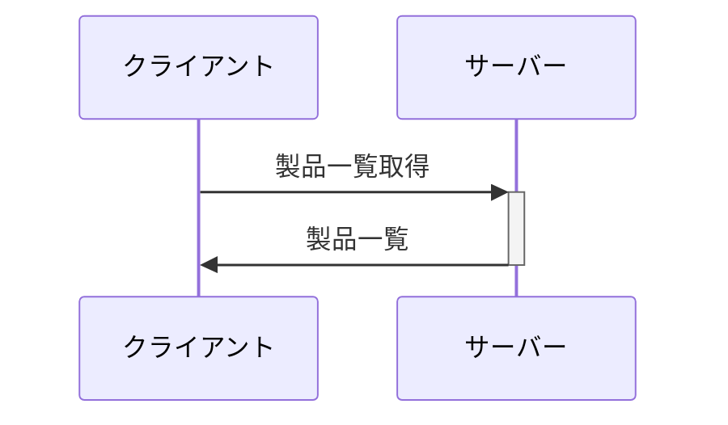
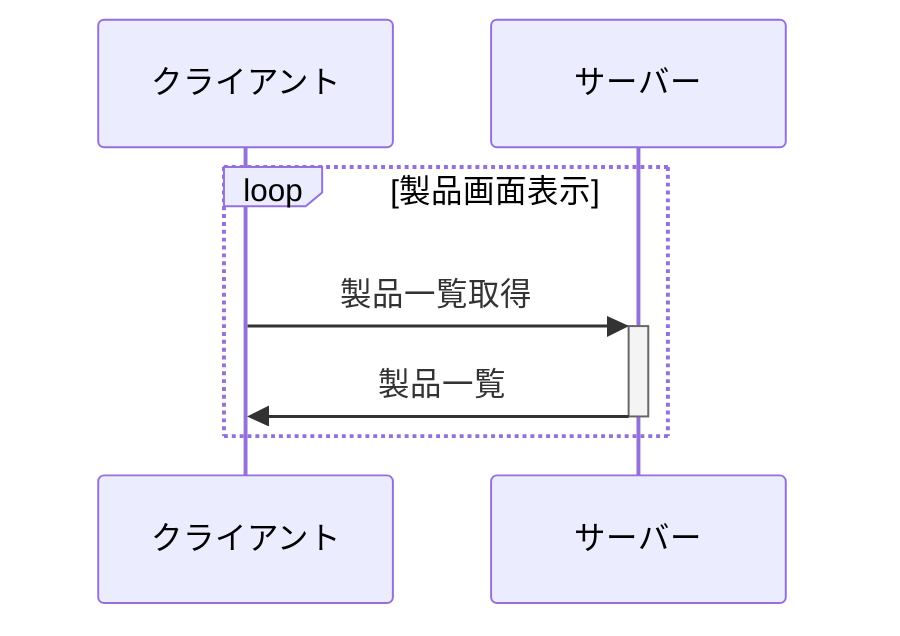
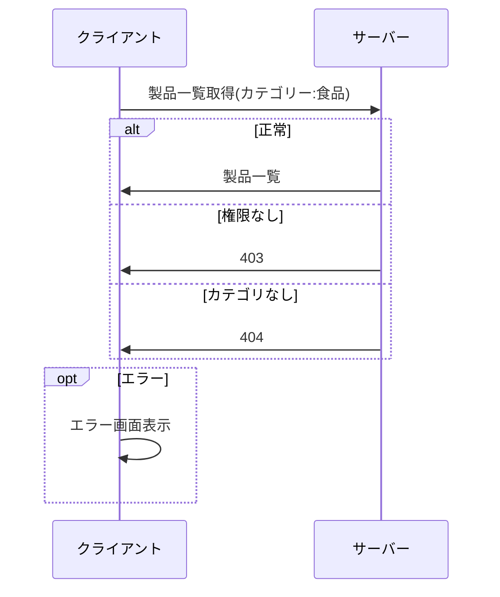
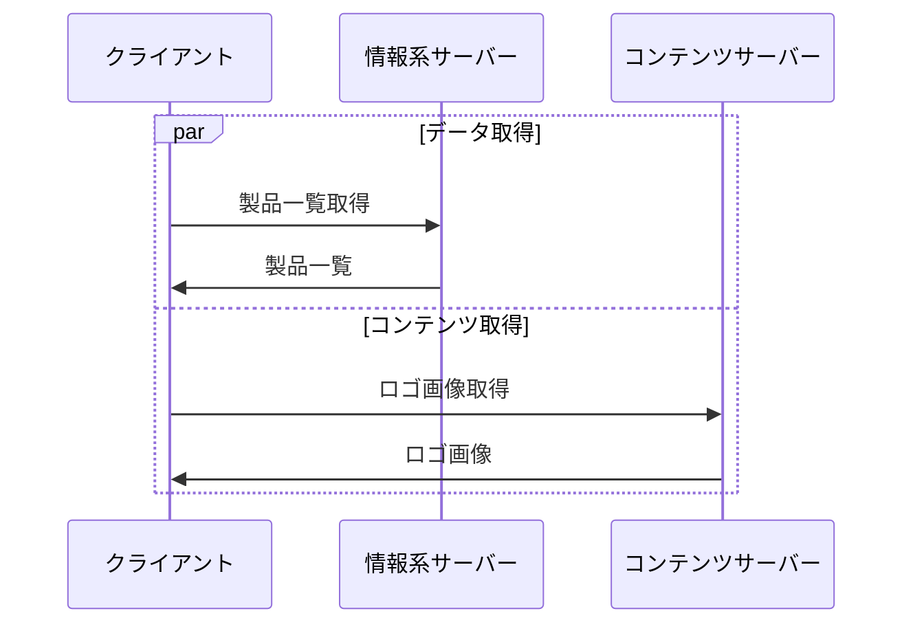
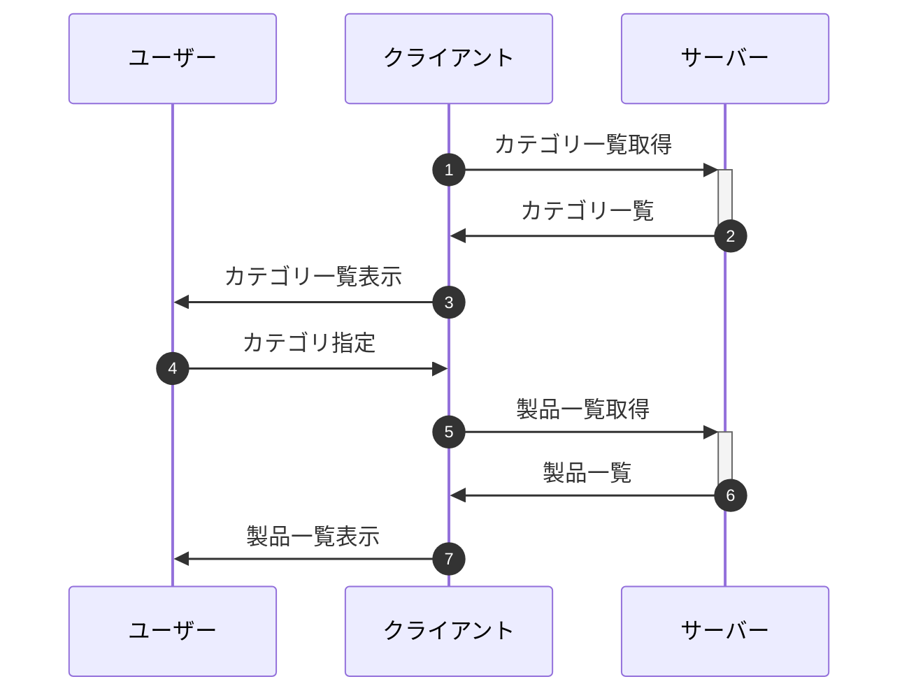

## 別名

```text
sequenceDiagram
    participant C as クライアント
    participant S as サーバー
    C->>S: 製品一覧取得
    S->>C: 製品一覧
```



## メッセージ

```text
sequenceDiagram
    participant C as クライアント
    participant S as サーバー
    C->S: 実線
    C-->S: 点線
    C->>S: 矢印
    C-->>S: 点線矢印
    C-)S: 細矢印
    C--)S: 点線細矢印
    C-xS: X印
    C--xS: 点線X印
```



## 補足

```text
sequenceDiagram
    participant C as クライアント
    participant S as サーバー
    Note left of C: WEBブラウザ
    C->>S: 製品一覧取得
    S->>C: 製品一覧
    Note over C,S: HTTPS
```



## 活性化

`+` で活性化して、 `-` で非活性化する

```text
sequenceDiagram
    participant C as クライアント
    participant S as サーバー
    C->>+S: 製品一覧取得
    S->>-C: 製品一覧
```



## ループ

```text
sequenceDiagram
    participant C as クライアント
    participant S as サーバー
    loop 製品画面表示
        C->>+S: 製品一覧取得
        S->>-C: 製品一覧
    end
```



## 分岐

```text
sequenceDiagram
    participant C as クライアント
    participant S as サーバー
    C->>S: 製品一覧取得(カテゴリー:食品)
    alt 正常
        S->>C: 製品一覧
    else 権限なし
        S->>C: 403
    else カテゴリなし
        S->>C: 404
    end
    opt エラー
        C->>C: エラー画面表示
    end
```



## 並列

```text
sequenceDiagram
    participant C as クライアント
    participant SA as 情報系サーバー
    participant SB as コンテンツサーバー
    par データ取得
        C->>SA: 製品一覧取得
        SA->>C: 製品一覧
    and コンテンツ取得
        C->>SB: ロゴ画像取得
        SB->>C: ロゴ画像
    end
```



## 番号

```text
sequenceDiagram
    autonumber
    participant U as ユーザー
    participant C as クライアント
    participant S as サーバー
    C->>+S: カテゴリ一覧取得
    S->>-C: カテゴリ一覧
    C->>U: カテゴリ一覧表示
    U->>C: カテゴリ指定
    C->>+S: 製品一覧取得
    S->>-C: 製品一覧
    C->>U: 製品一覧表示
```


