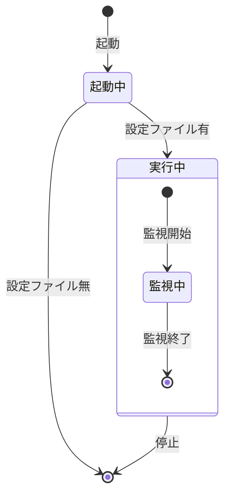

```text
stateDiagram-v2
    [*] --> 起動中: 起動
    起動中 --> 実行中: 設定ファイル有
    起動中 --> [*]: 設定ファイル無
    実行中 --> [*]: 停止

    state 実行中 {
        [*] --> 監視中: 監視開始
        監視中 --> [*]: 監視終了
    }
```


```mermaid
stateDiagram-v2
    [*] --> 起動中: 起動
    起動中 --> 実行中: 設定ファイル有
    起動中 --> [*]: 設定ファイル無
    実行中 --> [*]: 停止

    state 実行中 {
        [*] --> 監視中: 監視開始
        監視中 --> [*]: 監視終了
    }
```
