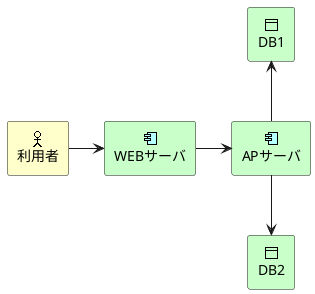

```text
@startuml
archimate #Business "利用者" as user <<actor>>
archimate #Technology "WEBサーバ" as web <<application-component>>
archimate #Technology "APサーバ" as ap <<application-component>>
archimate #Technology "DB1" as db1 <<object>>
archimate #Technology "DB2" as db2 <<object>>

user -> web
web -> ap
ap -up-> db1
ap -down-> db2
@enduml
```


