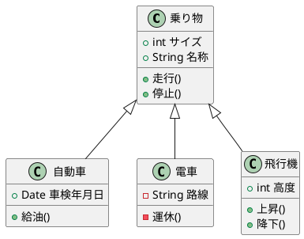
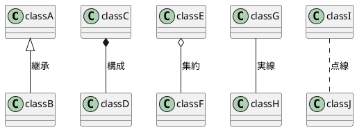
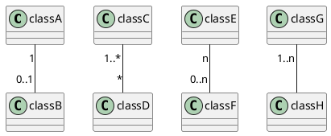

```text
@startuml
乗り物 <|-- 自動車
乗り物 <|-- 電車
乗り物 <|-- 飛行機
乗り物 : +int サイズ
乗り物 : +String 名称
乗り物 : +走行()
乗り物 : +停止()
class 自動車{
    +Date 車検年月日
    +給油()
}
class 電車{
    -String 路線
    -運休()
}
class 飛行機{
    +int 高度
    +上昇()
    +降下()
}
@enduml
```



### 関係性

```text
@startuml
classA <|-- classB : 継承
classC *-- classD : 構成
classE o-- classF : 集約
classG -- classH : 実線
classI .. classJ : 点線
@enduml
```



### 多重度

```text
classDiagram
    classA "1" -- "0..1" classB
    classC "1..*" -- "*" classD
    classE "n" -- "0..n" classF
    classG "1..n" -- classH
```


