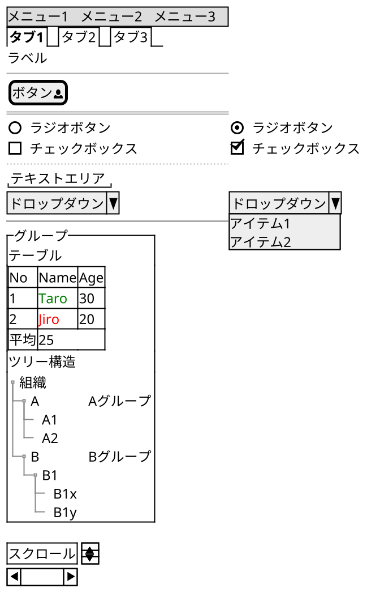

```text
@startsalt
scale 2
{
  {* メニュー1 | メニュー2 | メニュー3 }
  {/ <b>タブ1 | タブ2 | タブ3 }
  ラベル
  --
  [ボタン<&person>]
  ==
  ()  ラジオボタン | (X) ラジオボタン
  []  チェックボックス | [X] チェックボックス
  ..
  "テキストエリア    "
  ^ドロップダウン^ | ^ドロップダウン^^アイテム1^^アイテム2^
  ~~
  {^グループ
    テーブル
    {#
        No | Name | Age
        1 | <color:green>Taro | 30
        2 | <color:red>Jiro | 20
        平均 | 25 | *
    }
    ツリー構造
    {T
    +組織
    ++A     | Aグループ
    +++A1
    +++A2
    ++B     | Bグループ
    +++B1
    ++++B1x
    ++++B1y
    }
  }
  {S
    スクロール
  }
}
@endsalt
```


