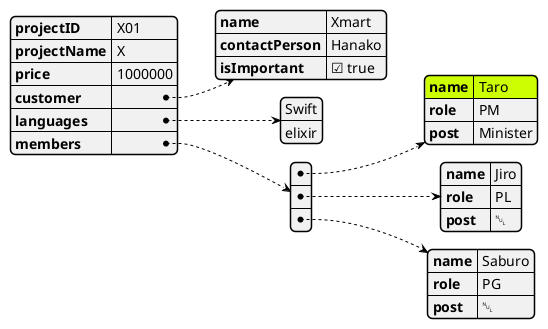

```text
@startjson
#highlight "members" / "0" / "name"
{
    "projectID": "X01",
    "projectName": "X",
    "price": 1000000,
    "customer": {
        "name": "Xmart",
        "contactPerson": "Hanako",
        "isImportant": true
    },
    "languages": [
        "Swift",
        "elixir"
    ],
    "members": [
        {
            "name": "Taro",
            "role": "PM",
            "post": "Minister"
        }
        , {
            "name": "Jiro",
            "role": "PL",
            "post": null
        }
        , {
            "name": "Saburo",
            "role": "PG",
            "post": null
        }
    ]
}
@endjson
```


