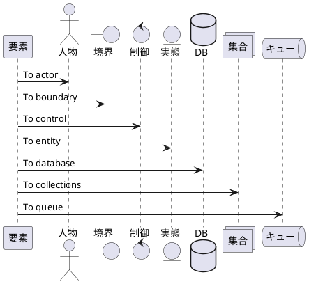
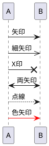
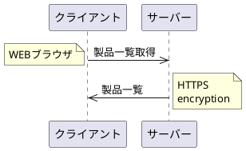
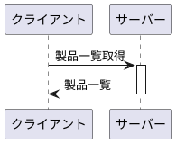
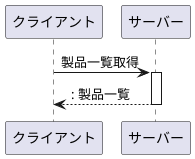
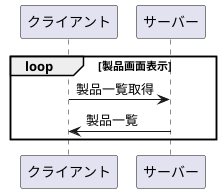
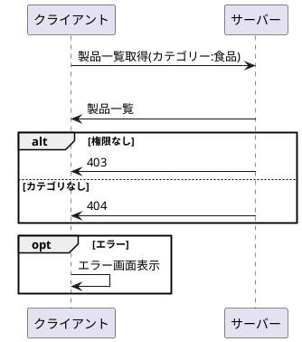
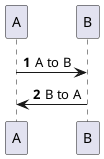

## 要素

```txt
@startuml
participant 要素 as Foo
actor       人物 as Foo1
boundary    境界 as Foo2
control     制御 as Foo3
entity      実態 as Foo4
database    DB as Foo5
collections 集合 as Foo6
queue       キュー as Foo7
Foo -> Foo1 : To actor
Foo -> Foo2 : To boundary
Foo -> Foo3 : To control
Foo -> Foo4 : To entity
Foo -> Foo5 : To database
Foo -> Foo6 : To collections
Foo -> Foo7: To queue
@enduml
```



## メッセージ

```text
@startuml
A -> B : 矢印
A ->> B : 細矢印
A ->x B : X印
A <-> B : 両矢印
A --> B : 点線
A -[#f00]> B : 色矢印
@enduml
```



## 補足

```text
@startuml
participant クライアント as C
participant サーバー as S
C->>S: 製品一覧取得
note left: WEBブラウザ
S->>C: 製品一覧
note right
HTTPS
encryption
end note
@enduml
```



## 活性化

```text
@startuml
participant クライアント as C
participant サーバー as S
C -> S : 製品一覧取得
activate S
S -> C : 製品一覧
deactivate S
@enduml
```



```text
@startuml
participant クライアント as C
participant サーバー as S
C -> S ++ : 製品一覧取得
S -> C -- : 製品一覧
@enduml
```


```text
@startuml
autoactivate on
participant クライアント as C
participant サーバー as S
C -> S : 製品一覧取得
return : 製品一覧
@enduml
```



## ループ

```text
@startuml
participant クライアント as C
participant サーバー as S
loop 製品画面表示
    C -> S : 製品一覧取得
    S -> C : 製品一覧
end
@enduml
```



## 分岐

```text
@startuml
participant クライアント as C
participant サーバー as S
C -> S : 製品一覧取得(カテゴリー:食品)
alt 正常
    S -> C : 製品一覧
alt 権限なし
    S -> C : 403
else カテゴリなし
    S -> C : 404
end
opt エラー
    C -> C : エラー画面表示
end
@enduml
```



## 番号


