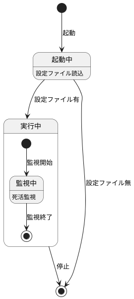

```text
@startuml
[*] --> 起動中: 起動
起動中 : 設定ファイル読込
起動中 --> 実行中: 設定ファイル有
起動中 --> [*]: 設定ファイル無
実行中 --> [*]: 停止

state 実行中 {
    [*] --> 監視中: 監視開始
    監視中 : 死活監視
    監視中 --> [*]: 監視終了
}
@enduml
```


```plantuml format="svg"
@startuml
[*] --> 起動中: 起動
起動中 : 設定ファイル読込
起動中 --> 実行中: 設定ファイル有
起動中 --> [*]: 設定ファイル無
実行中 --> [*]: 停止

state 実行中 {
    [*] --> 監視中: 監視開始
    監視中 : 死活監視
    監視中 --> [*]: 監視終了
}
@enduml
```
