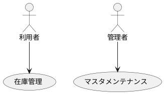
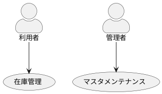
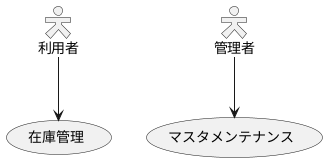
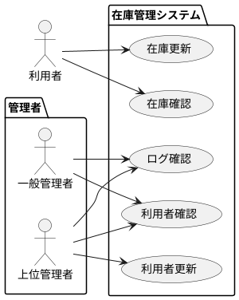

## アクター

```text
@startuml
"利用者" as User
"管理者" as Admin
"在庫管理" as (Use)
"マスタメンテナンス" as (Maintenance)
User --> (Use)
Admin --> (Maintenance)
@enduml
```



```text
@startuml
skinparam actorStyle awesome
"利用者" as User
"管理者" as Admin
"在庫管理" as (Use)
"マスタメンテナンス" as (Maintenance)
User --> (Use)
Admin --> (Maintenance)
@enduml
```



```text
@startuml
skinparam actorStyle Hollow
"利用者" as User
"管理者" as Admin
"在庫管理" as (Use)
"マスタメンテナンス" as (Maintenance)
User --> (Use)
Admin --> (Maintenance)
@enduml
```



## パッケージ

```text
@startuml
left to right direction
actor "利用者" as u
package 管理者 {
  actor "一般管理者" as a1
  actor "上位管理者" as a2
}
package 在庫管理システム {
  usecase "在庫確認" as UC1
  usecase "在庫更新" as UC2
  usecase "利用者確認" as UC3
  usecase "利用者更新" as UC4
  usecase "ログ確認" as UC5
}
u --> UC1
u --> UC2
a1 --> UC3
a1 --> UC5
a2 --> UC3
a2 --> UC4
a2 --> UC5
@enduml
```


