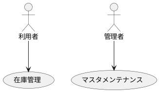
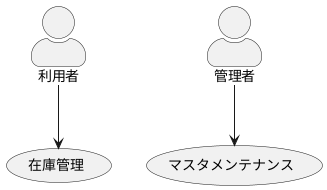
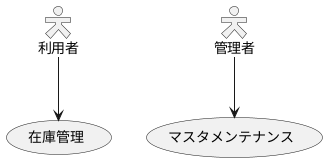

## アクター

```text
@startuml
"利用者" as User
"管理者" as Admin
"在庫管理" as (Use)
"マスタメンテナンス" as (Maintenance)
User --> (Use)
Admin --> (Maintenance)
@enduml
```



```text
@startuml
skinparam actorStyle awesome
"利用者" as User
"管理者" as Admin
"在庫管理" as (Use)
"マスタメンテナンス" as (Maintenance)
User --> (Use)
Admin --> (Maintenance)
@enduml
```



```text
@startuml
skinparam actorStyle Hollow
"利用者" as User
"管理者" as Admin
"在庫管理" as (Use)
"マスタメンテナンス" as (Maintenance)
User --> (Use)
Admin --> (Maintenance)
@enduml
```


